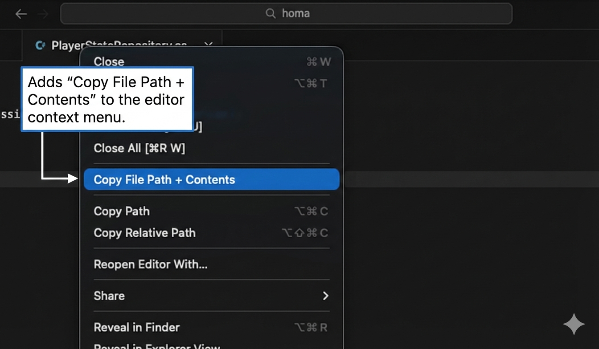
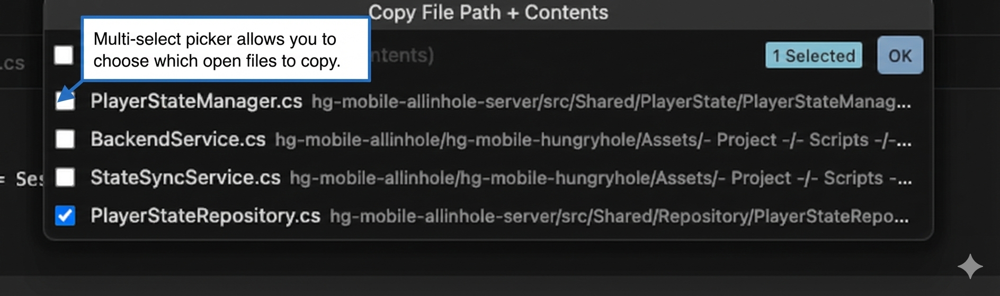

# Copy File Path + Contents

A simple VS Code / Cursor extension that copies the relative file path and full contents of open files to your clipboard.

## Usage

1. Right-click on any **editor tab**
2. Select **"Copy File Path + Contents"**



3. A multi-select picker appears with all open files — choose which ones to include
4. Press Enter — the paths and contents are copied to your clipboard



## Output Format

```
path/from/root/file1.ext
<file1 contents>

---

path/from/root/file2.ext
<file2 contents>
```

## Features

- Works with **multiple files** — pick from all open tabs
- Supports **untitled (unsaved) files**
- Uses **relative paths** from the workspace root
- Single open file is copied immediately without showing the picker

## Installation

Install from the VS Code Marketplace, or manually:

```
code --install-extension DictionaryLabs.copy-file-path-contents
```
